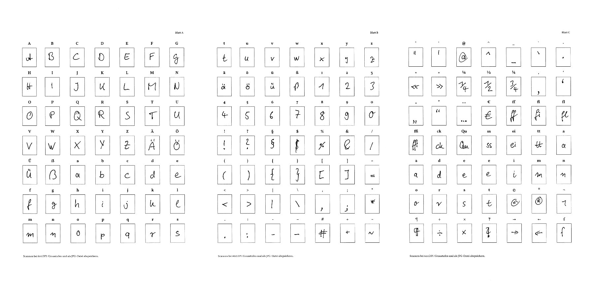
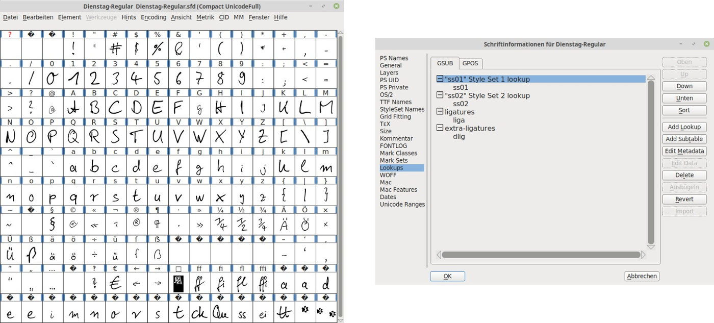

# Hand2Font

Von handgekritzelten Zeichen zum weiterbearbeitbaren Font. Drei Blatt mit je 49 Kästchen stehen bereit für die jeweils eigene Umsetzung der jeweiligen Zeichen. Sind die Kästchen ausgefüllt, können die Bögen gescannt werden -- bei **600dpi**, in **Graustufen** und im **jpg-Format**.

Die vorliegenden Bögen können dann umgewandelt werden. Dabei werden die Kästchen per `opencv` erkannt, der Inhalt der Boxen dann ausgeschnitten und die vorliegenden Einzelbilder der Kästcheninhalte umgewandelt in `*.ppm`-Dateien um diese dann per `potrace` zu vektorisieren.

Je nach Verwendung bestimmter Versionen zur Erfassung (version={1,2}) können damit `139` oder `147` Zeichen erfasst werden. Die erstellten `*.svg`-Dateien werden im nächsten Schritt an vorgesehenen Positionen im `Font` platziert.

## magic

Bei der Erstellung des Fonts werden zu den eigenen Zeichen noch weitere Einstellungen vorgenommen:

* der Zeichensatz festgelegt: `UnicodeFull`
* Versionsnummer für den Font vergeben: `1.0`
* font weight: `Regular`
* `fontname`, `familyname` und `fullname`
* `font.comment = 'FONT_COMMENT'`
* `font.copyright = 'FONT_LICENSE'`
* em-size: `2048`
* Layers: `cubic`
* `stylistic sets`
* `liga`, normale Ligaturen
* `dlig`, discretionary ligatures
* besondere Leerzeichen
* Katzenpfoten!
* `.notdef`-Quisquilie
* side bearings
* Größenanpassung ... automagisch
* Grundlinien- x-Höhen-Anpassung

## Lehre(n)

Wie nicht unschwer zu erkennen, waren und sind unterschiedliche Teile dieses Projekts auch für das eigene Lernen hinsichtlich `python`, `opencv`, `Fontforge` und Typografie im allgemeinen interessant.

Die automatische Umwandlung der Zeichen soll einige Schritte bei der Erstellung einer eigenen Schrift mit `Fontforge` beschleunigen. Es wartet auf jeden Interessierten aber noch genügend (Fein-)Arbeit bei der Verbesserung der automatisch erstellten `*.sfd`-Datei.

## Nutzung

Vorausgesetzt die passenden Module für die beiden Skripte sind vorhanden:

`python3 Scan2SVG.py -A a.jpg -B b.jpg -C c.jpg -t 160 -p Dateimuster -o Ordner -n Hand2Font -v 2`

`python3`: Ja, klar. Wobei python2 ebenfalls vorhanden sein sollte, zumindest für den zweiten Schritt und eben das zweite Skript, da dieses  `import fontforge` benötigt, bzw. `Fontforge` selbst die python3-Migration noch nicht abgeschlossen hat. `Scan2SVG.py` (python3) | `SVG2Font.py` (python2).

`Scan2SVG.py`: Skriptteil 1, welcher auch einzeln verwendet werden kann um die Zeicheninhalte zu vektorisieren.

`-A a.jpg -B b.jpg -C c.jpg`: Scans der Vorlagenblätter. Blatt {A,B,C}.

`-t 160`: Schwellwert hinsichtlich der Umwandlung (Kastenerkennung). Zwischen 0 und 255, wobei ich für den Standard ca. um die 160 vorschlagen würde.

`-p Dateimuster`: Dateinamenmuster der zu erstellenden Bilddateien für die einzelnen Kästcheninhalte.

`-o Ordner`: Ordnername und Ziel, in welchem die Dateien abgelegt werden.

`-n Hand2Font`: Wie soll der Font später heißen?

`-v 2`: welche Version zur Erfassung der Zeichen wurde verwendet?

## Bogen zur Erfassung

Zur Erfassung der Zeichen wird folgende Vorlage verwendet:

* [Hand2Font-02.pdf](Hand2Font-02.pdf) (`--version 2`, 147 Zeichen)
* Hand2Font-01.pdf (`--version 1`, 139 Zeichen)

Ausgefüllt könnte dies dann so aussehen:

## Beispielergebnis in Bildern

## Lizenz

[CC-BY-NC-SA-4.0](https://creativecommons.org/licenses/by-nc-sa/4.0/)
